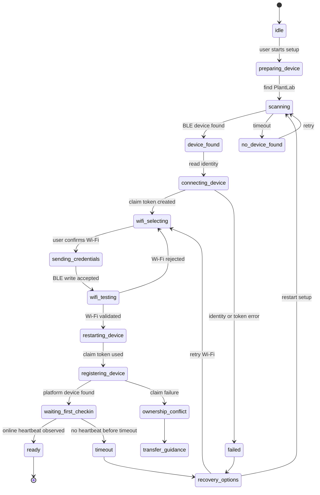

# PlantLab Onboarding & Provisioning Redesign Plan

## Scope

This document audits the current PlantLab onboarding and provisioning experience and defines a phased redesign roadmap. It is intentionally planning-only: no screen implementation, backend API changes, firmware behavior changes, or auth changes are included here.

The goal is a consumer smart-home setup flow where a user can plug in PlantLab, open the app, add the device, connect Wi-Fi, wait for setup, and land on an online device page with minimal ambiguity.

Target qualities:

- calm, guided, trustworthy, modern
- minimal BLE/Wi-Fi/backend terminology
- clear recovery paths
- no fake progress
- camera node complexity hidden from normal users

## Current Flow Audit

### Mobile Add Device Flow

Current mobile entry point:

- `platform/mobile/app/(app)/devices/add.tsx`
- `platform/mobile/src/screens/AddDeviceScreen.tsx`
- `platform/mobile/src/ble/bleProvisioning.ts`
- `platform/mobile/src/ble/bleProvisioningPayload.ts`

The current mobile screen uses three top-level UI steps:

- `find_device`
- `wifi_provisioning`
- `waiting_online`

Current happy path:

1. User taps add device.
2. User puts PlantLab into setup mode by holding the setup button for 5 seconds.
3. App scans BLE for `PlantLab-Setup-*`.
4. App reads BLE identity.
5. App creates a backend claim token bound to the device identity.
6. App reads nearby Wi-Fi networks from the device over BLE.
7. User chooses or types a Wi-Fi network and password.
8. App writes compact provisioning JSON to BLE.
9. Firmware validates Wi-Fi while BLE is still active.
10. Firmware saves pending config and reboots.
11. App polls claim-token status and platform setup status.
12. App routes to device detail when the backend sees the device online.

Existing strengths:

- BLE identity reduces serial-number friction.
- Wrong Wi-Fi password can fail quickly during BLE validation.
- Manual SSID and QR/serial fallback exist.
- Recovery mode verifies hardware identity before sending new Wi-Fi details.
- Factory-reset transfer conflict is now represented as a user-facing message.

Current UX weaknesses:

- The flow still exposes implementation language: BLE, setup token, fallback setup, SoftAP, setup device.
- The top-level state model is too coarse. `waiting_online` compresses reboot, Wi-Fi join, backend registration, first heartbeat, and ownership conflict into one screen.
- Waiting copy does not explain what the system is doing after 30 to 90 seconds.
- Error messages are improved but scattered across BLE helpers, mobile screen logic, platform polling, and provisioning backend failures.
- Users can reach dead-end uncertainty when BLE succeeds but backend registration or heartbeat confirmation is slow.
- The serial fallback is technically useful but visually reads like a debugging escape hatch.
- Recovery, factory reset, and transfer are operationally correct but need stronger consumer copy and timing expectations.

### Firmware Provisioning Flow

Relevant files:

- `device/esp32/src/main.cpp`
- `device/esp32/src/provisioning/ble_provisioning.cpp`
- `device/esp32/src/provisioning/provisioning_payload.cpp`
- `device/esp32/src/system/status_led.cpp`
- `device/esp32/src/system/power_button.cpp`

Current firmware provisioning states:

- `NORMAL`
- `PROVISIONING_BLE`
- `PROVISIONING_COMMITTING`
- `WIFI_CONNECTING`
- `BACKEND_REGISTERING`
- `PROVISIONING_FAILED`
- `PROVISIONING_SUCCESS`
- `FALLBACK_SOFTAP`
- `FACTORY_RESET_PENDING`

Current button behavior:

- Hold 5 seconds: enter BLE provisioning mode.
- Hold 20 seconds: factory reset local Wi-Fi/device tokens.

Current LED behavior:

- BLE provisioning: slow blink, roughly 200 ms toggle.
- Factory reset pending: fast blink, roughly 75 ms toggle.
- Error: double-pulse error pattern.
- SoftAP fallback: triple-pulse fallback pattern.

Current firmware strengths:

- Wi-Fi credentials are validated before pending config is committed.
- If Wi-Fi validation fails, BLE returns to writable `PROVISIONING_BLE`.
- Pending config protects existing devices during Wi-Fi recovery.
- If pending recovery fails and previous config exists, firmware restores the previous active config.
- Factory reset can happen offline because local credentials are cleared before reboot.
- After local factory reset, the next registration can send `factory_reset: true`.

Current UX risks:

- The app does not show the full firmware state ladder.
- Users are asked to interpret LED behavior but the app does not consistently show matching illustrations or timing.
- The 20-second factory reset is powerful and should have dedicated instructions separate from normal Wi-Fi recovery.
- Backend registration failure is only visible after the device has already rebooted, which creates a long uncertain wait.

### Backend Provisioning Flow

Relevant files:

- `provision_backend/src/routes/devices.js`
- `provision_backend/src/services/deviceProvisioningService.js`
- `provision_backend/src/models/provisioningSchemas.js`
- `platform/backend/app/api/routes/setup.py`

Current backend roles:

- Provisioning service creates and tracks claim tokens.
- Provisioning service registers hardware from claim tokens.
- Platform setup API polls whether the device appears, is online, has readings, and optionally has an image.
- Platform setup API writes provisioning canonical events.

Current ownership behavior:

- If a hardware ID belongs to another user and the registration does not include `factory_reset: true`, the claim token records `device_owned_by_another_user`.
- If `factory_reset: true` is present, backend releases the old hardware binding and continues registration for the new user.
- If recovery targets an existing platform device, mobile sends `attach_to_platform_device_id`.

Current backend strengths:

- Ownership conflict is explicit.
- Claim-token status lets mobile detect conflicts before a generic timeout.
- Factory-reset transfer works without requiring the old device to call backend during reset.

Current backend UX risks:

- Claim token status, setup status, and BLE status are separate mental models in the app.
- The app has to infer whether a timeout is Wi-Fi, backend registration, first heartbeat, or conflict.
- Setup status still has web-era concepts such as first reading and first image, which can make master-node onboarding feel slower than necessary.

### Web / Legacy Setup Flow

Relevant files:

- `platform/backend/app/web/templates/add_device.html`
- `platform/backend/app/web/templates/setup_finishing.html`

The legacy web flow still exists for setup-code and SoftAP compatibility. It has a setup checklist and polling behavior, but it also labels itself as legacy web and uses older setup concepts.

Recommendation: keep legacy web setup as compatibility fallback. Do not make it the primary polished onboarding path.

## Prioritized Problems

1. Waiting state is too broad.

   Users see "Connecting your Smart Planter" while the device may be validating Wi-Fi, rebooting, registering, waiting for first heartbeat, or blocked by ownership. This makes long waits feel broken.

2. User-facing copy leaks system internals.

   BLE, SoftAP, setup token, fallback setup, backend confirmation, and hardware identity are useful for engineers but should be hidden or translated.

3. Recovery choices are correct but not yet self-explanatory.

   A user needs to know the difference between:

   - reconnect Wi-Fi: hold 5 seconds
   - factory reset: hold 20 seconds
   - prepare transfer: release in account, then factory reset hardware

4. Error handling is distributed.

   BLE parse errors, firmware status errors, provisioning service errors, setup polling errors, and timeout messages are not governed by one user-facing error catalog.

5. Camera node onboarding should not be user-facing.

   The system correctly treats camera nodes as part of the logical device. The UI should not ask users to onboard a camera node separately.

6. Progress feedback lacks stage history.

   Users need a clear stage checklist and current stage, not a generic spinner for the whole setup.

7. Fallback paths can feel like a debugging mode.

   QR/serial and SoftAP fallback should remain available, but the primary path should stay simple and visually calm.

## Ideal Onboarding Journey

### Screen 1: Welcome To PlantLab

Purpose: prepare the user and explain the physical action.

Primary copy:

- "Let's set up your PlantLab."
- "Plug in your device, keep your phone nearby, and hold the setup button for 5 seconds until the light blinks."

Primary action:

- "Find PlantLab"

Secondary action:

- "Use serial number"

### Screen 2: Find Nearby PlantLab

Purpose: scan for nearby devices without exposing BLE.

State mapping:

- app state: `scanning`
- BLE status: Bluetooth available, scan active
- firmware state expected: `PROVISIONING_BLE`

UX behavior:

- show a calm searching animation
- show "Looking for nearby PlantLab devices"
- show recovery hint after 6 seconds
- if multiple devices are found, show short suffix + signal strength

### Screen 3: Connect To PlantLab

Purpose: read identity and create claim token.

State mapping:

- app state: `connecting_device`
- backend action: create claim token

UX behavior:

- show selected device
- avoid "claim token"
- say "Securing setup for this device"

### Screen 4: Choose Wi-Fi

Purpose: select or type Wi-Fi credentials.

State mapping:

- app state: `choosing_wifi`
- BLE action: Wi-Fi scan from device

UX behavior:

- emphasize 2.4 GHz support without overexplaining
- default to strongest scanned network
- allow manual entry
- show password visibility toggle
- show "PlantLab will test this before saving"

### Screen 5: Setting Up PlantLab

Purpose: one unified progress screen with real stages.

Recommended stages:

1. Sending Wi-Fi details
2. Testing Wi-Fi
3. Restarting PlantLab
4. Registering device
5. Waiting for first check-in

Rules:

- Do not use fake progress percentages.
- Mark completed stages only when the app observes the corresponding state.
- After 20 seconds, add "This can take a little longer on some routers."
- After 45 seconds, show troubleshooting tips.
- After 90 seconds, offer Retry check, Retry Wi-Fi, and Compatibility setup.

### Screen 6: PlantLab Ready

Purpose: confirm success and transition to the product experience.

Copy:

- "PlantLab is online."
- "Your device is connected and ready to monitor your plant."

Primary action:

- "Open device"

Secondary action:

- optional "Name your plant" later, not required for setup completion.

## Recommended Onboarding State Machine

Use a single mobile view-model state machine that maps BLE, firmware, provisioning service, and platform polling into user-facing states.

Recommended user-facing states:

- `idle`
- `preparing_device`
- `scanning`
- `device_found`
- `connecting_device`
- `wifi_selecting`
- `sending_credentials`
- `wifi_testing`
- `restarting_device`
- `registering_device`
- `waiting_first_checkin`
- `ready`
- `failed`
- `timeout`
- `ownership_conflict`
- `recovery_options`

Internal states should remain visible in debug logs and diagnostics only.

## Loading-State Recommendations

### Scanning

Show:

- "Looking for PlantLab nearby"
- "Keep your phone close to the device."
- "The status light should be blinking."

After scan timeout:

- "No nearby PlantLab found."
- Actions: Retry, Show button instructions, Use serial number.

### Wi-Fi Scan

Show:

- "Checking networks PlantLab can see"

If no networks:

- "No nearby Wi-Fi networks were reported. You can still type your Wi-Fi name."

### Setting Up

Show stage checklist:

- Wi-Fi details sent
- Wi-Fi tested
- Device restarting
- Device registered
- First check-in received

Avoid:

- percentage progress
- "backend"
- "claim token"
- "BLE payload"

### Long Wait

At 20 seconds:

- "Still working. Some routers take longer to reconnect new devices."

At 45 seconds:

- "Keep PlantLab powered on and close to your router. If this does not finish, you can retry Wi-Fi."

At timeout:

- show clear options, not a dead end:
  - Retry online check
  - Change Wi-Fi password
  - Use compatibility setup

## Error Messaging Recommendations

| Condition | Current Source | Recommended User Message | Primary Action |
| --- | --- | --- | --- |
| No BLE device found | `no_devices` | "No nearby PlantLab found. Hold the setup button for 5 seconds until the light blinks, then try again." | Retry scan |
| Bluetooth off | `bluetooth_off` | "Turn on Bluetooth to find PlantLab." | Open system settings / retry |
| Permission denied | `permission_denied` | "Bluetooth permission is needed to set up PlantLab from the app." | Open settings |
| Identity unreadable | `identity_unavailable` | "The app could not identify this PlantLab. Restart setup mode and try again." | Retry |
| Multiple devices found | scan result | "Choose the PlantLab closest to you." | Device picker |
| Wi-Fi not found | `wifi_network_not_found` | "PlantLab could not find that Wi-Fi network. Choose a nearby 2.4 GHz network or type the name again." | Back to Wi-Fi |
| Wrong Wi-Fi password | `wifi_connect_failed` | "PlantLab could not join this Wi-Fi. Check the password and try again." | Edit password |
| Wi-Fi timeout | `wifi_connect_timeout` | "PlantLab could not join Wi-Fi before the timeout. Move it closer to the router and try again." | Retry Wi-Fi |
| Backend registration failed | register HTTP error | "PlantLab joined Wi-Fi but could not finish setup. Check your internet connection and try again." | Retry online check |
| Device owned by another account | claim token failure | "This PlantLab is already registered to another account. Release it from that account or factory reset the device before adding it here." | Show transfer guidance |
| Claim token expired | claim status | "Setup took too long. Restart setup to create a fresh secure setup session." | Restart setup |
| Setup timeout | platform poll | "PlantLab may still be connecting. You can keep checking or try Wi-Fi setup again." | Retry check / retry Wi-Fi |
| Recovery identity mismatch | `identity_mismatch` | "This is not the PlantLab selected for recovery. Choose the matching device." | Select again |

## Re-Provisioning And Recovery

### Change Wi-Fi / Router Replacement

Recommended flow:

1. User opens Device Settings.
2. User taps "Reconnect Wi-Fi."
3. App explains: "This keeps your device and history in this account."
4. User holds setup button for 5 seconds.
5. App scans and verifies the hardware ID.
6. User enters new Wi-Fi.
7. Firmware validates new Wi-Fi before replacing active config.
8. If new Wi-Fi fails after reboot, firmware restores previous config when possible.

### Repair Setup

Use when device is still in the account but needs provisioning repair.

Recommended copy:

- "Use this if PlantLab is offline after changing networks or moving rooms."

### Transfer To Another Account

Recommended flow:

1. Account A opens Device Settings.
2. Account A taps "Prepare device for transfer."
3. Backend releases or archives the device for Account A.
4. App instructs Account A to hold the device button for 20 seconds.
5. Account B adds the device normally.

### Factory Reset Without Network

Required behavior already exists conceptually:

1. User holds device button for 20 seconds.
2. Device clears local Wi-Fi and account tokens offline.
3. Next provisioning registration includes `factory_reset: true` because no previous runtime registration remains.
4. Backend releases the old hardware binding and continues registration for the new account.

UX requirement:

- Explain this as "full reset" rather than "factory reset transfer flag."
- Tell users the light blinks quickly after the 20-second reset is accepted.
- Make clear that factory reset affects the physical device; old history may remain in the previous account unless it was released.

## Camera Node Recommendation

Recommendation: hide camera node onboarding from the normal user flow.

Reasoning:

- Current architecture treats master plus camera nodes as one logical PlantLab device.
- Design docs already state camera nodes should not appear as separate user-managed devices.
- Camera node setup can lag after master setup and should not block the user from reaching the dashboard unless the product absolutely requires the first photo.

User-facing behavior:

- During setup, say "Camera will connect automatically."
- On the device dashboard, show camera status if it is still connecting.
- In diagnostics, expose camera node details for advanced troubleshooting.

Do not add a separate "Add Camera Node" step for normal users.

## Simulator-Driven Onboarding Test Scenarios

The simulator can support product QA for post-registration states, but BLE provisioning itself requires real firmware or mocked mobile BLE adapters. Recommended scenarios:

- successful onboarding
- no nearby device
- Bluetooth permission denied
- wrong Wi-Fi password
- Wi-Fi unavailable
- slow backend registration
- first heartbeat delayed
- device reboot during setup
- ownership conflict from another account
- factory-reset transfer to a new account
- camera node connects late

Expected UX per scenario:

- every failure should show a user-language explanation
- every failure should offer at least one recovery action
- no scenario should leave only a spinner

## Visual And Interaction Direction

Use the existing PlantLab design tokens and mobile polish direction:

- large, calm headings
- one primary action per step
- rounded but restrained cards
- clear status chips
- high contrast text
- minimal technical labels
- progress shown as a stage checklist
- subtle setup animation, not a busy engineering dashboard

Accessibility requirements:

- all actions have clear labels
- setup animation is decorative
- status is represented by text, not color alone
- error messages are readable without expanding details
- buttons remain usable with large text settings

## Phased Redesign Roadmap

### Phase 1: Visual Cleanup, Loading States, Copy

Target files:

- `platform/mobile/src/screens/AddDeviceScreen.tsx`
- `platform/mobile/src/ble/bleProvisioningPayload.ts`
- `platform/mobile/src/components/*` as needed

Work:

- replace technical copy with user-language copy
- create one reusable setup stage checklist component
- improve scanning, Wi-Fi, and waiting empty/loading states
- keep current APIs and firmware behavior unchanged

Validation:

- mobile typecheck
- mobile unit tests
- manual installed iPhone build for BLE behavior

### Phase 2: Unified Onboarding View Model

Target files:

- `platform/mobile/src/screens/AddDeviceScreen.tsx`
- new `platform/mobile/src/onboarding/*` helpers if useful

Work:

- add an `OnboardingStage` adapter that maps BLE status, claim-token status, setup status, and timeouts into the recommended state machine
- centralize user-facing error messages
- make retry actions stage-aware

Validation:

- mobile typecheck
- BLE payload tests
- manual flows: success, wrong password, setup timeout

### Phase 3: Recovery And Transfer Flows

Target files:

- `platform/mobile/src/screens/DeviceSettingsScreen.tsx`
- `platform/mobile/src/screens/AddDeviceScreen.tsx`
- provisioning docs

Work:

- dedicated recovery intro screens for Wi-Fi reconnect, repair, and transfer
- clearer 5-second vs 20-second button instructions
- ownership conflict screen with two choices: release from old account or full reset
- copy around offline factory reset and Account B provisioning

Validation:

- backend provisioning tests for factory-reset transfer
- mobile manual QA with `dev@plantlab.local` and `dev1@plantlab.local`
- firmware serial log confirmation for 5-second and 20-second holds

### Phase 4: Motion, Polish, Accessibility

Target files:

- mobile onboarding components
- design token docs if needed

Work:

- polished setup animation
- improved device picker visuals
- reduced motion support
- accessibility labels and large text checks
- screenshots for App Store/test docs

Validation:

- iOS device QA
- accessibility pass
- no changes to backend/firmware required

## Recommended First Implementation Slice

Start with Phase 1: create a polished `OnboardingProgress` component and update the existing `AddDeviceScreen` copy/loading states without changing APIs.

Why this first:

- lowest risk
- immediately improves the current long-wait problem
- does not require firmware changes
- keeps the existing BLE and backend logic intact
- creates reusable UI for Phase 2 state-machine work

Suggested first deliverables:

- stage checklist component
- revised scanning and waiting copy
- timeout guidance copy
- centralized copy constants for user-facing provisioning errors
- manual QA checklist for one successful setup and one wrong-password setup

## Risks And Dependencies

- Real BLE behavior cannot be fully validated in Expo Go; use an installed development build.
- iOS Bluetooth permission and local network prompts can interrupt the flow and must be handled in copy.
- The 20-second reset transfer flow depends on firmware correctly deciding when to include `factory_reset: true`.
- Camera node readiness can lag master readiness; avoid blocking primary setup on a first image unless product requirements change.
- Setup status currently depends on backend polling and heartbeat timing; long local network delays need graceful UI treatment.
- SoftAP fallback remains useful but should not become the primary path unless BLE support fails on a target platform.

## Open Questions

- Should first image be required for setup completion on any current hardware variant, or should image readiness always move to dashboard post-setup?
- Should the app offer router compatibility tips before or only after Wi-Fi failure?
- Should ownership transfer include an explicit "I factory reset the physical device" confirmation before Account B retries?
- Should BLE signal strength be shown to normal users or only used for sorting multiple devices?
